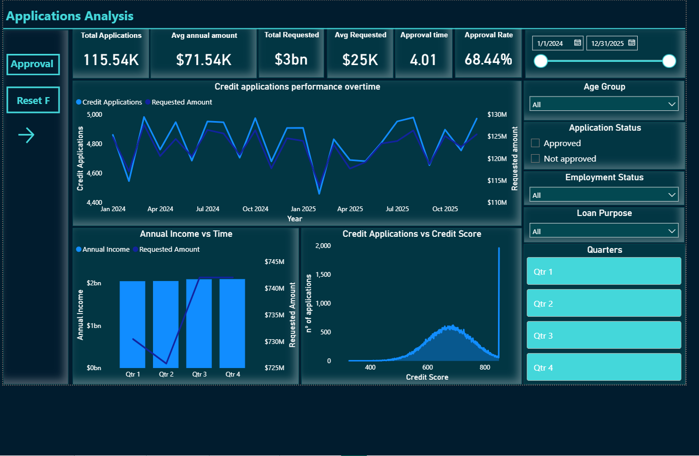
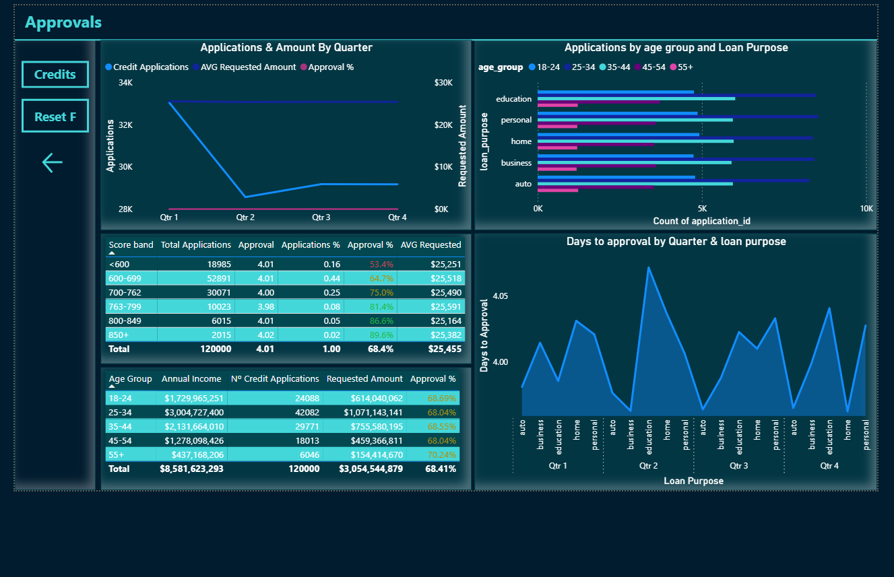
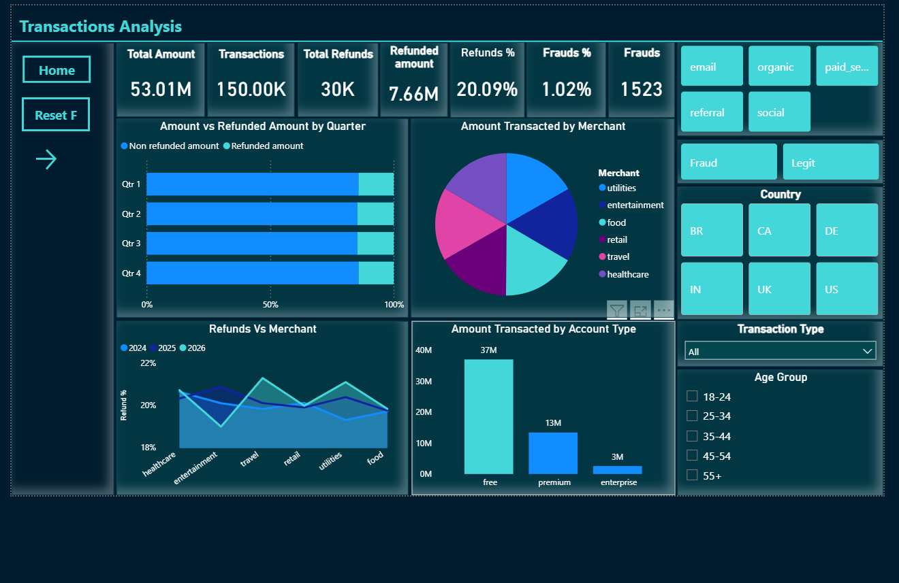
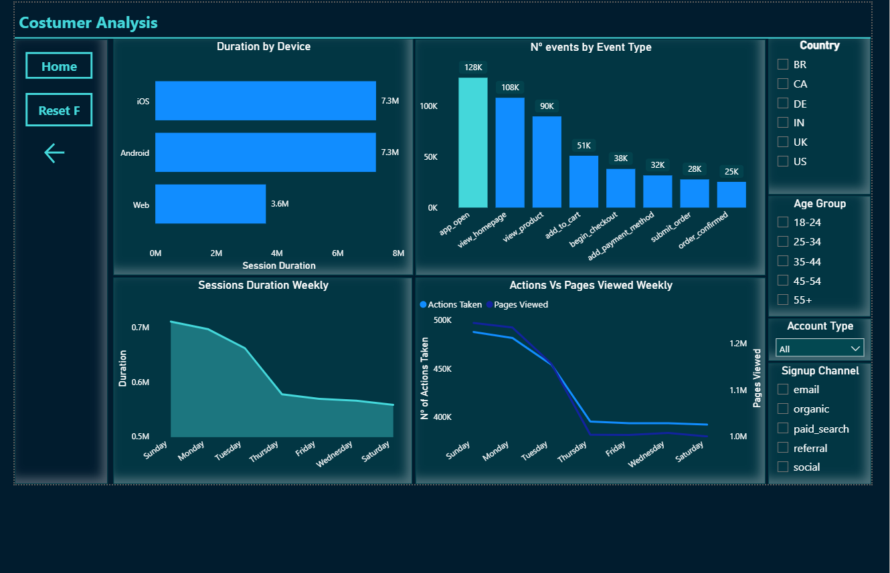

# Fintech Product Performance: Credit Applications & Transactions

**Date:** February 2026  
**Reporting Period:** January 2024 – December 2025  
**Data Sources:** `credit_applications.csv` · `transactions_fintech.csv` · `user_activity_retention.csv` · `users_cohort.csv`  
**Records:** 115,539 credit applications · 144,561 transactions · 100,000 users · 300,000 activity records

---

## Executive Summary

> **Key Finding:** Credit applications and revenue are stable year-over-year (< 1% variance), not declining. The business shows seasonal Q1 softness and a significant conversion funnel gap, with only 19.5% of app opens resulting in confirmed orders. The 5% default rate is uniform across all credit score bands, suggesting the scoring model may not be adding predictive value for risk.

| Metric | Value |
|--------|-------|
| Total Applications | 115,539 |
| Approval Rate | 68.4% |
| Avg Requested Amount | $25,449 |
| Default Rate | 5.06% |
| Transactions | 144,561 |
| Transaction Volume | $51.0M |
| Fraud Rate | 1.02% |
| Avg Lifetime Value | $2,501 |

### Top Findings

- **Stable demand:** YoY applications changed by only −0.6%, with total requested amounts down just 0.9%. There is no evidence of a significant downward trend.
- **Seasonal Q1 weakness:** Q1 consistently shows the lowest application volume each year (14,200–14,390), a 2–3% dip from peak quarters. February is the weakest individual month.
- **Default rate is flat across all score bands (5%):** A credit scoring model should produce differentiated default rates. The uniform 5% across <600 to 850+ bands suggests the model adds no predictive value for default risk.
- **Conversion funnel drop-off:** Only 19.5% of app opens lead to confirmed orders. The biggest single drop is view_product → add_to_cart (43% loss).
- **Transaction type clarification:** The "20% refund rate" on the dashboard represents 
- **LTV is uniform:** Average lifetime value is rounding $2,501 across all account types, age groups, signup channels, and countries. No segment produces meaningfully higher LTV.

---

## 1. Credit Application Demand

### Dashboard: Applications Analysis



### 1.1 Year-over-Year Stability

Contrary to an initial hypothesis of significant quarterly declines, the data shows remarkable stability across all key credit metrics over the two-year period.

| Metric | 2024 | 2025 | Change | Assessment |
|--------|------|------|--------|------------|
| Applications | 57,950 | 57,589 | −0.62% | ✅ Stable |
| Total Requested | $1.477B | $1.464B | −0.90% | ✅ Stable |
| Avg Requested | $25,485 | $25,413 | −0.28% | ✅ Stable |
| Approval Rate | 68.49% | 68.40% | −0.09pp | ✅ Stable |
| Avg Income | $71,791 | $71,282 | −0.71% | ✅ Stable |

All year-over-year changes fall within 1%, indicating statistical noise rather than meaningful trends. The business is neither growing nor declining in its core credit product.

### 1.2 Quarterly Patterns

Quarterly application volumes range from 14,181 (Q2 2025) to 14,622 (Q4 2025), a total spread of just 3.1%.

| Quarter | Apps | Total Req | Avg Req | Approval % | QoQ Change |
|---------|------|-----------|---------|------------|------------|
| 2024 Q1 | 14,390 | $370M | $25,683 | 68.6% | — |
| 2024 Q2 | 14,394 | $366M | $25,393 | 68.8% | +0.03% |
| 2024 Q3 | 14,604 | $373M | $25,539 | 68.1% | +1.5% |
| 2024 Q4 | 14,562 | $369M | $25,325 | 68.5% | −0.3% |
| 2025 Q1 | 14,200 | $361M | $25,413 | 68.8% | −2.5% |
| 2025 Q2 | 14,181 | $360M | $25,409 | 68.6% | −0.1% |
| 2025 Q3 | 14,586 | $369M | $25,302 | 68.2% | +2.9% |
| 2025 Q4 | 14,622 | $373M | $25,526 | 68.0% | +0.2% |

> **Seasonal Pattern:** Q1 shows a consistent 2–3% dip, with February as the weakest month each year (4,547 in 2024; 4,461 in 2025). Q3–Q4 tend to be marginally stronger.

### 1.3 Recommended Actions

1. Run targeted Q4 acquisition campaigns (Oct–Dec) to capitalise on naturally stronger demand and build a pipeline for Q1.
2. A/B test loan conditions (interest rates, repayment terms) during Q1 to offset the seasonal dip, particularly for personal and home loans.
3. Investigate competitor Q1 promotions that may be drawing applicants away during the weak period.

---

## 2. Credit Risk & Default Analysis

### Dashboard: Approvals



### 2.1 Credit Score Segmentation

The 600–762 credit score range accounts for 69.2% of all applications and represents the volume engine of the business.

| Score Band | Apps | % of Total | Approval % | Avg Requested | Default % |
|------------|------|-----------|------------|---------------|-----------|
| <600 | 18,260 | 15.8% | 53.5% | $25,264 | 5.01% |
| 600–699 | 50,918 | 44.1% | 64.7% | $25,511 | 5.04% |
| 700–762 | 28,944 | 25.1% | 75.1% | $25,462 | 5.14% |
| 763–799 | 9,654 | 8.4% | 81.4% | $25,598 | 5.06% |
| 800–849 | 5,800 | 5.0% | 86.5% | $25,176 | 4.93% |
| 850+ | 1,963 | 1.7% | 89.7% | $25,439 | 5.28% |

> ⚠️ **Critical Finding: Uniform Default Rate**  
> Default rates are essentially identical (5%) across all credit score bands, from <600 to 850+. In a well-functioning credit scoring model, lower scores should default significantly more. This uniformity suggests either: (a) the scoring model does not predict defaults in this portfolio, (b) the approval process already filters out high-risk applicants so effectively that residual default risk is equalised. **This asks for a deeper investigation.**

### 2.2 Default Rate by Loan Purpose

Default rates are also nearly uniform across loan purposes, ranging from 4.9% (education) to 5.3% (personal).

| Loan Purpose | Applications | Approval % | Avg Requested | Default % |
|-------------|-------------|------------|---------------|-----------|
| Auto | 22,855 | 68.5% | $25,535 | 5.00% |
| Business | 22,977 | 68.6% | $25,428 | 4.93% |
| Education | 23,321 | 68.5% | $25,477 | 4.91% |
| Home | 23,160 | 68.7% | $25,362 | 5.22% |
| Personal | 23,226 | 67.9% | $25,445 | 5.25% |

### 2.3 Recommended Actions

1. Implement risk-based pricing: if score bands carry different risk, adjust interest rates accordingly; if they do not, recalibrate the model.
2. Analyse default timing: determine whether defaults cluster early (first 3 months) or late in the loan lifecycle to inform collection strategies.

---

## 3. Customer Segments

### 3.1 Age Group Analysis

The 25–34 age cohort is the largest segment at 35.1% of applications, but LTV is uniform across all groups.

| Age Group | Apps | % of Total | Approval % | Avg Income | Avg Requested | Avg LTV |
|-----------|------|-----------|------------|------------|---------------|---------|
| 18–24 | 23,178 | 20.1% | 68.8% | $71,827 | $25,478 | $2,492 |
| 25–34 | 40,513 | 35.1% | 68.0% | $71,444 | $25,450 | $2,499 |
| 35–44 | 28,698 | 24.8% | 68.6% | $71,601 | $25,371 | $2,513 |
| 45–54 | 17,331 | 15.0% | 68.1% | $70,979 | $25,498 | $2,501 |
| 55+ | 5,819 | 5.0% | 70.5% | $72,376 | $25,568 | $2,494 |

### 3.2 Account Type Analysis

Free accounts dominate at 69.9% of applications, but LTV is virtually identical across all tiers.

| Account Type | Apps | % of Total | Approval % | Avg LTV |
|-------------|------|-----------|------------|---------|
| Free | 80,740 | 69.9% | 68.3% | $2,503 |
| Premium | 29,215 | 25.3% | 68.7% | $2,499 |
| Enterprise | 5,584 | 4.8% | 68.9% | $2,492 |

> **Insight:** Premium and enterprise accounts do not generate higher lifetime value than free accounts. Either premium benefits need strengthening, or the pricing model needs restructuring to create real differentiation.

### 3.3 Employment Status

| Employment | Apps | % of Total | Approval % | Avg Income | Avg Requested |
|-----------|------|-----------|------------|------------|---------------|
| Employed | 80,600 | 69.8% | 68.5% | $71,645 | $25,486 |
| Self-employed | 17,364 | 15.0% | 68.5% | $71,116 | $25,220 |
| Unemployed | 11,785 | 10.2% | 68.7% | $71,495 | $25,557 |
| Retired | 5,790 | 5.0% | 67.7% | $71,386 | $25,406 |

### 3.4 Recommended Actions

1. Focus acquisition on 25–34 age group for volume, but develop upsell paths to increase their ARPU through premium features.
2. Redesign premium/enterprise tier benefits: test lower rates, faster approval, or higher credit limits as differentiators.
3. Review approval criteria for unemployed applicants to ensure default risk is appropriately priced.

---

## 4. Transaction Analysis

### Dashboard: Transactions Analysis



### 4.1 Transaction Overview

144,561 transactions totalling $51.0M were processed in 2024–2025. Withdrawals account for 57% of total value despite only 20% of transaction count.

| Type | Count | Amount | % of Value |
|------|-------|--------|-----------|
| Withdrawal | 28,862 | $29.1M | 57.0% |
| Refund | 29,031 | $7.4M | 14.5% |
| Transfer | 28,900 | $5.0M | 9.7% |
| Deposit | 28,934 | $4.8M | 9.4% |
| Payment | 28,834 | $4.8M | 9.4% |


### 4.2 Geography

The United States accounts for 40.2% of transactions and $20.6M in volume.

| Country | Transactions | % of Total | Amount | Avg Txn | Fraud % |
|---------|-------------|-----------|--------|---------|---------|
| US | 58,149 | 40.2% | $20.6M | $354 | 1.02% |
| UK | 21,530 | 14.9% | $7.5M | $349 | 1.10% |
| BR | 21,729 | 15.0% | $7.7M | $353 | 0.97% |
| DE | 14,560 | 10.1% | $5.2M | $360 | 0.97% |
| CA | 14,354 | 9.9% | $5.0M | $352 | 1.11% |
| IN | 14,239 | 9.8% | $5.0M | $349 | 0.96% |

### 4.3 Fraud Assessment

The overall fraud rate of 1.02% is well-controlled and consistent across all dimensions. However, 1,296 fraud-flagged transactions completed successfully, representing $460K in potential losses that should be investigated.

### 4.4 Recommended Actions

1. Investigate the 1,296 completed fraud transactions to identify detection gaps.
2. Continue US market investment as the primary revenue driver; explore growth in BR and UK.

---

## 5. Product Funnel & User Engagement

### Dashboard: Customer Analysis



### 5.1 Conversion Funnel

The event funnel shows a significant conversion gap, with only 19.5% of users who open the app ultimately confirming an order.

| Stage | Events | Step Conversion | Overall | Note |
|-------|--------|----------------|---------|------|
| App Open | 128K | — | 100% | |
| View Homepage | 108K | 84.4% | 84.4% | |
| View Product | 90K | 83.3% | 70.3% | |
| **Add to Cart** | **51K** | **56.7%** | **39.8%** | **⚠️ Biggest drop-off** |
| Begin Checkout | 38K | 74.5% | 29.7% | |
| Add Payment | 32K | 84.2% | 25.0% | |
| Submit Order | 28K | 87.5% | 21.9% | |
| Order Confirmed | 25K | 89.3% | 19.5% | |

> ⚠️ **Conversion Bottleneck: View Product → Add to Cart**  
> 43.3% of users drop off between viewing a product and adding it to their cart. This is the single largest funnel loss and should be the primary UX optimisation target.

### 5.2 Device & Session Patterns

Mobile platforms (iOS + Android) account for 80% of all sessions.

| Device | Sessions | % of Total | Avg Duration |
|--------|----------|-----------|-------------|
| iOS | 120,112 | 40.0% | 60.5 min |
| Android | 119,850 | 40.0% | 60.6 min |
| Web | 60,038 | 20.0% | 60.6 min |

**Day-of-week patterns:** Session counts are evenly distributed across all seven days although the longest sessions take place in Sunday and Monday, so these are days where the promotional and startegic content should be pushed out, specially the mobile versions.

### 5.3 Recommended Actions

1. Prioritise the product page → add-to-cart transition: run A/B tests on layout, information hierarchy, and CTA placement.
2. Optimise for mobile-first: with 80% of sessions on iOS/Android, ensure the add-to-cart and checkout flows are optimised for touch.

---

## 6. Strategic Recommendations

Ranked by expected business impact:

### Priority 1: Audit the Credit Scoring Model
The uniform 5% default rate across all score bands is the most strategically significant finding. It means the business is denying 47% of applicants in the <600 band for no material risk reduction. Fixing this could unlock substantial revenue.

### Priority 2: Fix the Conversion Funnel
Only 19.5% of app opens convert to confirmed orders. The view-product to add-to-cart step loses 43% of users. Improving this single step by even 10 percentage points could yield a 20% increase in confirmed orders.

### Priority 3: Create Real Account Tier Differentiation
Premium and enterprise accounts produce identical LTV to free accounts. Redesign benefits around tangible credit advantages: lower rates, higher limits, or priority approval.

### Priority 4: Seasonal Marketing Calendar
Deploy Q4 acquisition campaigns (October–December) to capitalise on stronger demand. Develop Q1 retention offers (January–March) to offset the seasonal dip.


---

## Methodology

This analysis covers January 2024 through December 2025 (2026 Q1 excluded as incomplete). 

---

## Repository Structure

```
├── README.md                    ← This report
├── images/
│   ├── 1.png
│   ├── 2.png
│   ├── 3.png
│   └── 4.png
├── data/
│   ├── credit_applications.csv
│   ├── transactions_fintech.csv
│   ├── user_activity_retention.csv
│   └── users_cohort.csv
└── sql/
    └── Exploratory_Analysis.sql
```
